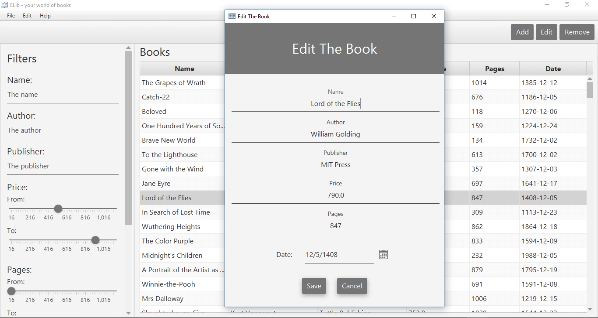

# ELib - your world of books

Простое тестовое приложение на Java с использованием material-дизайна на основе библиотеки JFoenix

YouTube: https://youtu.be/OgBQY0YI-40

### Описание

Приложение представляет собой простой интерфейс для сохранения, оборажения и фильтрации книг.

Главное окно приложения состоит из 2 основных частей - фильтров и таблицы книг.

Книги можно добавлять, редактировать, удалять. Для добавления и 
редактирования книг открывается отдельное окно (введенные данные валидируются).

### Технические детали

Верстка приложения резиновая. При надобности появляются скролы, 
но ничего безследно не исчезает.

Книги в приложении сохраняются в бинарном либо текстовом файле. Для этого 
реализованы классы `TextStorage<T>` и `BinaryStorage<T>`. В приложнеии свободно 
можно менять тип хранилища с TextStorage на BinaryStorage и наоборот.

### Используемые языки и библиотеки:

- Java
- JavaFX (FXML)
- JFoenix
- Sass (css)
